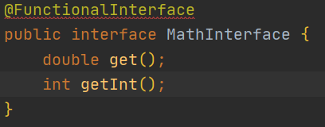

출처 : 나


메서드 참조란?
-
* 메소드 참조(method reference)는 람다 표현식이 단 하나의 메소드만을 호출하는 경우에 해당 람다 표현식에서 불필요한 매개변수를 제거하고 사용할 수 있도록 해준다. 
* 세미콜론 두개(::)로 메소드를 참조할 수 있다. 그것은 아래와 같다.
```java
// 랜덤 값을 언제던 꺼낼 수 있도록 랜덤 메소드를 참조해둠
MathInterface i = Math::random;
```
* 중요한 점은 메소드를 호출하는 것이 아니라 그냥 참조 (언제든 호출 할 수 있도록 주소를 담아둠)만 하는 점이라는 것이다.

자바스크립트에서 함수 참조
-
* 자바스크립트(Javascript)에서 함수는 아래와 같은 방법으로 변수에 담을 수 있다.
```js
let func_value = function (a, b) { return a + b; }
console.log(func_value(1,2)); // 3
```

* 객체에 내부에 있는 메소드를 참조하는 것 또한 어렵지 않다.
```js
function js_Object () {
    // 
    this.func = function(a, b) {
        return a + b;
    }
}
// 생성자로 생성한 객체의 메소드를 담는다.
let func_value = new js_Object().func;
console.log(func_value(1,2)) // 3
```

* 함수 내부의 프로퍼티를 참조하고 있다. 위 문법이 너무 어렵다면 ES6의 설탕 문법인 클래스를 통해 클래스 멤버(프로퍼티)를 참조해보자.
```js
class js_Object {
    func(a, b) {
        return a + b;
    }
}
// 생성한 객체의 메소드를 변수에 직접 참조하고 있다.
let func_value = new js_Object().func;
console.log(func_value(1,2)); // 3
```

자바스크립트처럼 메소드를 참조하기
-

그럼 자바는 어떻게 담아야 하는가?  
자바에서 모든 메소드는 클래스의 멤버이다.  
따라서 클래스의 인스턴스, 또는 클래스 자체(static)를 통해서만 호출 되어야 한다.  
변수에 클래스의 메서드(멤버)를 직접 참조하는 것은 허용하지 않는다.  
아래와 같이 참조해보자

```java
Member member = new Memeber("kim");
// member 인스턴스를 통해서 함수에 접근하고 있다.
member.getName(); // kim

// 에러 => 점(.)을 통해 변수에 값을 담는 것은 불가능하다. 오직 호출된 값 또는 객체만 담을 수 있다.
Function func = member.getName; 
func(); // 에러 => 호출이 되지 않음
```
그럼 아예 참조가 불가능할까?  
정답을 말하자면 아니다.

자바에서 메소드가 생성 되는 순간, 해당 메소드는 메모리에 상주하면서 언제든 호출 되기를 기다리고 있다.  
즉, 메소드 또한 메모리에 주소가 있고, 때문에 주소를 변수에 담을 수 있을 것이다.
주소를 찾아 메서드를 실행하면 그만 아닌가!

어디에 담아야 할까?
-
그럼 어디에 담을 수 있을까?  
무엇을 이용하면 메소드를 참조할 수 있게 할 수 있을까?

정답은 인터페이스이다.   
위에서 보면 MathInterface 인터페이스에 Math의 Random 함수를 바라보도록(참조하도록) 선언을 해두었다.  
그리고 아래와 같이 호출할 수 있다.

📌 [Run1.java](./Run1.java)
-

```java
// 변수 i가 Math 클래스의 random 이라는 함수를 바라보도록(참조하도록) 했다.
MathInterface i = Math::random;
System.out.println(i.get()); // 0.6163065003355584 => 호출이 가능하다.
```

왜 인터페이스일까?
-
정답은 인터페이스에 특징에 있다.  
인터페이스는 구현되지 않은 메서드를 가질 수 있다.  
이 때 메서드의 내용물(body)은 구현 되어지지 않은채 선언만 되어 있어야 한다.

또한, 인터페이스를 구현한 모든 객체는 해당 메서드를 정의 해야한다. 
그리고 인터페이스에는 메서드가 입력받는 값의 타입과 리턴타입이 정해져 있다. 

"파라미터 타입과 리턴 타입은 동일"하고 "동작"만 다르다는 것이 핵심이다.
즉, 인터페이스에 **메소드가 1개라고 가정**하고 인터페이스 함수를 바라본다면 해당 인터페이스는 메서드의 "동작"을 담을 "빈 껍데기"와 매우 닮아 있다는 것이다. 

인터페이스가 동작(행동, 메소드 호출)하려면 implements를 통해서 이던, 익명 클래스로 정의를 받던
무조건 **정의 받아야** 하는데, 굳이 새로 작성할 필요가 있을까?

리텁타입과 파라미터 타입이 동일한 "기존에 구현된" 메소드를 
빈 껍데기에 참조만 하면 더 간편하게 사용할 수 있다.

아래 코드를 보자

📌 [MathInterface.java](./MathInterface.java)
-

```java
@FunctionalInterface
public interface MathInterface {
    double get();
}
```

그리고 Math 클래스의 random 함수를 보자
```java
public static double random() {
    return RandomNumberGeneratorHolder.randomNumberGenerator.nextDouble();
}
```
* MathInterface 의 get과 Math의 random 모두 return 타입이 동일하고 매개변수가 없다.

아래와 같이 변수 자바의 연산의 도움을 받아 Math 클래스의 random 함수를 참조할 수 있다.
```java
MathInterface i = Math::random;
```


그럼 자바는 어떻게 인터페이스로 생성한 변수 i 가 메소드를 참조하고 있다는 것을 확신해?
-
@FunctionalInterface 어노테이션을 통해 보장 받는다
@FunctionalInterface 붙으면 인터페이스는 오직 하나의 메서드만 가질 수 있다.
즉, 메서드가 오직 하나 이기 때문에 해당 인터페이스에 담긴 것은 객체가 아닌 하나의 메서드를 가리키는 주소임을 보장 받을 수 있는 것이다.

그래서 실제 메서드를 두개 작성하는 순간 에러가 난다. 그것은 아래와 같다.



그리고 인터페이스의 함수가 하나인 것을 보장 받기 때문에 
자바에서는 이 인터페이스를 완전히 함수 취급하듯 호출이 가능하다.
이 말은 즉, 인터페이스를 넘기나 메소드 참조값을 넘길 때나 모두 동일하게 동작한다는 말이다.  
이 말의 의미는 나중에 살펴보기로 하고
일단 클래스와 인터페이스를 직접 만들어보자

📌 [MathBox.java](./MathBox.java)
-

<details>
    <summary>펼치기</summary>

    public class MathBox {
        private int instance_value;
    
        public MathBox() {}
    
        public MathBox(int value) {
            this.instance_value = value;
        }
    
        // 더하기
        public int sum(int a, int b) {
            return a + b;
        }
    
        // 빼기
        public int sub(int a, int b) {
            return a - b;
        }
    
        // 나누기
        public static int div(int a, int b) {
            return a / b;
        }
    
        //곱하기
        public static int mul (int a, int b) {
            return a * b;
        }
    
        public int getSumWithInstance(int a, int b) {
            return this.instance_value + a + b;
        }
    }
</details>    

* 이름을 보면 알 수 있지만, 여러가지 계산 기능을 제공하는 메소드의 집합이다.
* 공통 적으로 int 라는 값을 return 하고 int 타입 파라미터 2개를 받는다.
* 그리고 나누기와 곱하기는 static 메소드로 선언된 것을 알 수 있다.

그럼 이제 이 메소드를 받을 인터페이스를 만들어보자

📌 [Function.java](./Function.java)
-

    @FunctionalInterface
    public interface Function {
        int func(int a, int b);
    }

* 보면 @FunctionalInterface 어노테이션이 붙어있고 오직 하나의 메소드만 있다.
* 그리고 MathBox.java 의 멤버 메소드 들과 리턴타입, 파라미터의 타입(개수도)이 같다.

아래와 같이 사용해보자.

📌 [Run2.java](./Run2.java)
-
```java
MathBox box = new MathBox();
Function sum  = box::sum;       // 인스턴스 멤버이기 때문에 box라는 인스턴스를 통해서만 접근 가능하다.
Function mul  = MathBox::mul;   // static 멤버이기 때문에 MathBox 라는 클래스를 통해서 접근이 가능하다.

System.out.println(sum.func(1,2)); // 3
System.out.println(mul.func(1,2)); // 2
```
위와 같은 형식으로 사용이 가능하다.

* box::sum 의 실제 메서드는 아래와 같다.
```java
// 더하기
public int sum(int a, int b) {
    return a + b;
}
```
* 즉, box::sum 를 참조한 객체를 호출할 때 **int 타입 매개변수를 2개** 넘겨주어야 하고, **return 하는 타입**은 int 임을 알 수 있다.
* 이를 인지하는 것은 함수형 프로그래밍에서 메소드참조 (::) 를 이해하는데 큰 도움을 준다.

자바에서는 이 인터페이스를 완전히 함수 취급하듯 호출이 가능하다.
-
* 자바에서 @FunctionalInterface이 붙은 인터페이스를 함수형 인터페이스라고 부르는 데 함수형 인터페이스는 완전히 함수 취급하듯 호출할 수 있다고 했다. 

이 말의 의미를 살펴보기 위해 코드를 작성하자

📌 [Number.java](./Number.java)
-
<details>
    <summary>펼치기</summary>


    public class Number {
        private int a;
        private int b;
    
        public Number(int a, int b) {
            this.a = a;
            this.b = b;
        }
    
        /**
         * 인터페이스 Function 를 받아 내부의 함수를 호출하여 얻은 값을 출력한다.
         * */
        public void print(Function func) {
            System.out.println(func.func(this.a, this.b));
        }
    
        public int sum() {
            return this.a + this.b;
        }
    }

</details>

📌 [Run3.java](./Run3.java)
-
    
    // 메소드를 참조
    Function mul = MathBox::mul;
    
    Number number = new Number(1, 5);
    // 인터페이스를 넘기나 인터페이스의 함수 참조값을 넘기나 동일하고 에러도 없다.
    number.print(mul);          // 5
    number.print(mul::func);    // 5


함수의 주소를 "참조"만 하는 것이기 때문에 해당 메소드를 포함하는 인스턴스의 내부의 상황을 반영하고 있다. 
아래 코드를 보자

📌 [Run4.java](./Run4.java)
-

    // 박스 1 생성. 이 때 생성자를 통해 내부적으로 instance_value 값으로 20을 가짐
    MathBox box1 = new MathBox(20);
    MathBox box2 = new MathBox(0);

    // 함수형 인터페이스를 통해 받았음
    Function sum1 = box1::getSumWithInstance;
    Function sum2 = box2::getSumWithInstance;

    // 같은 5 + 5 를 수행함
    System.out.println(sum1.func(5,5)); // 30
    System.out.println(sum2.func(5,5)); // 10

* 생성자를 통해서 20, 0 을 가지는 MathBox 를 두개 생성 후 같은 sum 함수를 인터페이스로 참조
* 값은 서로 다르게 나왔다.

getSumWithInstance 함수 내부를 보면 아래와 같다.

    public class MathBox {
        // 생성자를 통해 주입받는 필드
        private int instance_value;
        ...
        public int getSumWithInstance(int a, int b) {
            return this.instance_value + a + b;
        }
    }

인스턴스의 멤버필드인 instance_value 의 값이, 인터페이스(변수,sum1)를 통해 호출했을 때의 값에 반영이 되어 있다는 말이다.

람다와 메서드 참조의 관계?
-

람다란 무엇일까? 
-
* 람다식은 간단히 말해서 메서드를 하나의 '식(expression)'으로 표현한 것이다.
* 메소드의 "동작"을 정의 한 **구현체**이기 때문에 메소드참조 대신 아래와 같은 람다표현식으로 대체가 가능하다. (자바에선 람다는 객체가 아닌 함수로 봐야 한다고 한다.)

📌 [Run5.java](./Run5.java)
-

    MathBox box = new MathBox();
    
    Function sum1 = box::sum;
    // 람다 표현식
    Function sum2 = (int a, int b) -> a+b;

    System.out.println(sum1.func(5,5)); // 10
    System.out.println(sum2.func(5,5)); // 10

그리고 아래와 같이 다양한 방법으로 
메소드를 호출할 수 있다.

📌 [Run5.java](./Run5.java)
-

    // 익명 클래스로 인터페이스 생성
    Function sum3 = new Function() {
        @Override
        public int func(int a, int b) {
            return a+b;
        }
    };
    System.out.println(sum3.func(5,5)); // 10
---

Stream과 함께 사용하기 
-

📌 [Run6.java](./Run6.java)
-
<details>
    <summary>펼치기</summary>


    // 인자로 넘겨준 객체를 리스트로 만들어 준다.
    List<String> stringList1 = Arrays.asList("01","02","03");
    
    // stringList 으로 부터 stream 을 뽑아낸다.
    stringList1.stream()
            // Integer::parseInt 를 참조한다.
            .map(Integer::parseInt)
            // 다시 리스트로 가공한다.
            .collect(Collectors.toList())
            // 리스트의 문자열을 반복적으로 출력한다.
            .forEach(System.out::println);


    List<String> stringList2 = Arrays.asList("01","02","03");

    stringList2.stream()
            // 람다로 작성해도 똑같다.
            .map(e->Integer.parseInt(e))
            .collect(Collectors.toList())
            .forEach(System.out::println);

</details>

* ".map(Integer::parseInt)" 부분이 핵심이다. stream의 map은 매개변수로 Function 인터페이스를 받는다. 그리고 넘어온 메소드(A)를 호출하기 위해 stringList1 을 반복하면서 선택된 문자열을 A의 매개변수로 넘겨줄 것이다. 
* Integer::parseInt 을 통해 return 받은 타입을 다시 리스트로 만들어 출력하는 로직이다.
* 아래와 같이 람다식으로도 변경이 가능하다.


📌 [MemberVO.java](./MemberVO.java)
-

    public class MemberVO {
        public static boolean isClassOf(Object obj) {
            return obj.getClass() == MemberVO.class;
        }
    }

📌 [UserVO.java](./UserVO.java)
-

    public class UserVO {
        String name;
    }
    
📌 [Run7.java](./Run7.java)
-

    List<Object> simpleList = Arrays.asList(
            new MemberVO(), // true
            new UserVO()    // false
    );

    // MemberVO::isClassOf MemberVO 의 클래스가 맞는지 판별
    simpleList.stream()
            .map(MemberVO::isClassOf)
            .collect(Collectors.toList())
            .forEach(System.out::println);

* 이런식으로 사용이 가능하다.