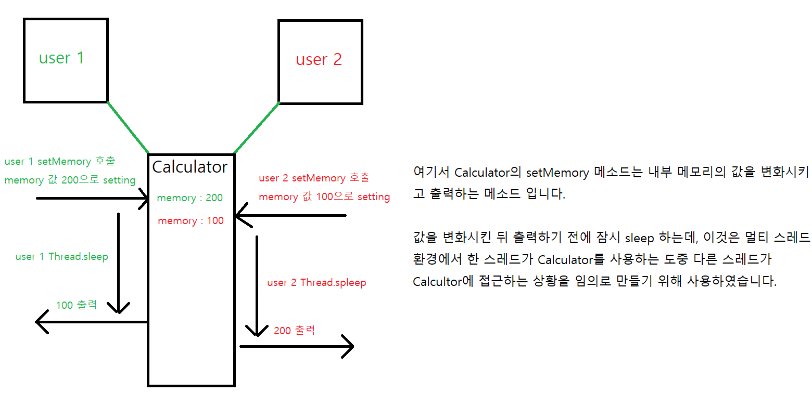
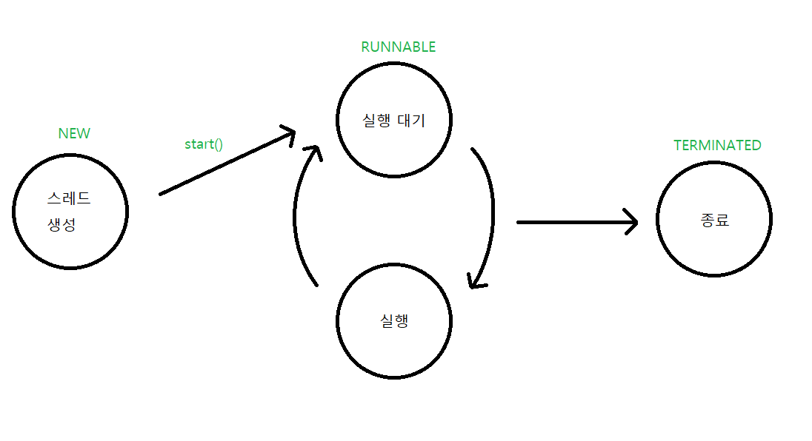

* 스레드에 대해서 알기 위해서는 먼저 프로세스에 대해서 알 필요가 있음


<br/>

📌 프로세스란?
-
* 필요한 메모리를 운영체제로 부터 받아서 애플리케이션의 코드를 실행하는 것
* 하나의 애플리케이션은 멀티 프로세스를 만들기도 함 
    * 예를 들어서 메모장 프로그램을 2개 실행 했다면 2개의 프로세스가 생성 된 것
    * 이와 같이 두가지 이상 작업을 동시에 하는 것을 멀티 태스킹이라고 함. => 멀티 프로세스
    
<br/>

📌 멀티 태스킹
-
* 두가지 작업을 동시에 실행시키는 것
    * 운영체제는 두가지 이상의 작업을 멀티 태스킹 할 수 있도록 CPU 자원을 프로세스마다 적절하게 할당해주고 병렬로 실행함

* 멀티태스킹은 멀티 프로세스 뿐 아니라, 멀티 스레드 또한 멀티 태스킹의 일종
    * 예를 들어서 미디어 플레이어는 하나의 프로세스 안에서 동영상을 재생하면서 동시에 음악 재생을 함

* 각각의 메모리를 운영체제로 부터 할당 받았기 때문에 스레드간 메모리를 공유하지 않음 (독립적)

<br/>

📌 스레드란?
-
* 한가지 작업을 실행하기 위해 순차적으로 실행할 코드를 이어 놓은 것
* 하나의 프로세스는 여러 스레드(코드 흐름)를 가질 수 있음
* 프로세스는 운영체제에서 할당 각각 메모리를 할당 받기 때문에 독립적이고, 다른 프로세스에서 오류가 발생해도 다른 프로세스에 영향을 미치지 않습니다.


<br/>

📌 멀티 스레드
-
* 허나 멀티스레드는 같은 프로세스 내부에 생성 되기 때문에 하나의 스레드가 예외를 발생시키면 프로세스 자체가 종료될 위험이 있음
* 따라서 멀티스레드를 생성하는 경우 예외 처리에 만전을 기해야함


> 멀티 스레드 사용 예시
* 대용량 데이터 처리의 시간을 줄이기 위해 데이터를 분할해서 병렬 처리
* UI 를 가지고 있는 애플리케이션이 네트워크 통신을 할 때
* 많은 서버 개발을 할 때 사용


<br/>

📌 메인 스레드
-
* 자바의 모든 애플리케이션은 main 메소드를 실행하면서 시작.
    * 이 메소드가 시작되면 메인 스레드가 시작 됩니다.
* 메인 스레드는 필요에 따라서 작업 스레드들을 만들어서 병렬로 코드 처리를 할 수 있습니다.
* 메인 스레드에서 생성한 스레드가 여러개일 때, 이 멀티 스레드 중에서 하나라도 종료되지 않은 스레드가 있으면 메인 스레드는 종료 되지 않습니다.


<br/>


📌 작업 스레드 생성과 실행 
-
* 스레드를 생성할 때에는 각 스레드가 어떤 작업을 할 것인지 결정하고 작업별로 스레드를 생성해야함
    * 메인 작업
    * 네트워킹
    * 드로잉

> Thread 클래스로부터 직접 생성하기
* Runnable interface를 구현한 클래스 객체를 이용해서 Thread 생성자를 호출하며 만든 참조를 start 해서 만듭니다.
    * [Thread 클래스로 직접 생성하기 예제](./runnable/Run.java)
    ```java
    Runnable runnable = new Sample(); // Sample 클래스 구현
    Thread thread = new Thread(runnable);
    thread.start();
    ```
    * Sample 는 Runnable interface를 구현한 클래스의 객체 입니다.
    * start를 호출하면 내부적으로 run 메소드를 호출해서 코드를 실행합니다.
    * 위 방법 보다는 "익명 객체" 또는 "람다식"를 이용한 방법을 많이 사용합니다.
    ```java
    Thread threadWithAnanymous = new Thread(() -> {
        // Run 에 해당하는 코드 흐름을 넣어줍니다.
    });
    threadWithAnanymous.start();
    ```
    * [샘플 소스](./runnable/ThreadSample.java)

> Thread 를 상속받은 클래스로부터 생성하기
* Thread 클래스를 상속 받고 run 메소드를 오버라이드 해서 실행하는 방법
    * [Thread 하위 클래스로 생성하기 예제](./thread/Run.java)
    ```java
    Work work = new Work();
    work.start();
    ```
    * Work 는 Thread 클래스를 extends 하고 있다. 자바에서 상속은 1개만 가능하기 때문에 이 방법보단 Runnable을 구현하는 방법을 많이 사용한다.
    * 이것도 마찬가지로 "익명 객체"를 이용해서 코드를 절약할 수 있다.
   ```java
   Thread newWork = new Thread() {
       // 작업을 적습니다.
   };
   newWork.start();
   ```
  
> Thread 에 이름 부여하기
* 디버깅을 할 때 어떤 작업을 하는지 조사할 목적으로 가끔 사용
* 기본적으로 thread-n(n은 번호) 이름으로 많이 설정 됨
* [예제 코드 참고](./name/Run.java)


<br/>

📌 스레드 사용시 주의점 (동기화)
-
* 멀티 스레드 환경에서는 스레드들이 객체를 공유해서 작업하는 경우가 많이 생깁니다. 이 때 많이 발생하는 문제가, 상태 변경에 관한 문제 입니다.
* 예를 들어서 여러 사람이 계산기를 함께 나누어 쓰는 상황을 예로 설명할 수 있습니다. 사람 A가 계산기로 작업을 하다가 잠시 다른데에 다녀왔는데 그 사이에 B가 계산기로 다른 작업을 했다면 A가 작업한 기록은 없기 때문에 A가 다시 돌아왔을 때는 B가 만들어놓은 엉터리 값을 이용하게 됩니다.
 


* [예제 코드](./multi/Run.java) 를 참고하면, NoneSynchronizedCalculator를 사용할 때에는 서로 다른 thread가 객체를 같은 객체를 공유하면서 문제가 발생한 경우이고 SynchronizedCalculator 를 사용할 때에는 같은 객체를 공유했지만, 하나의 스레드가 사용할 때 다른 스레드가 변경할 수 없도록 잠금을 거는 키워드를 사용했기 때문에 서로 다른 값을 출력합니다.
* 단, 하나의 스레드만 실행할 수 있는 코드 영역을 임계 영역이라고 하는데 자바에서는 임계영역을 지정하기 위해서 동기화 메소드를 지원합니다.
```java
synchronized
```
* 위 키워드는 인스턴스와 정적 메소드 어디든 붙일 수 있다.
```java
public synchronized void method() {
    // 임계 영역 => 단 하나의 스레드만 실행
}
```
* 스레드가 동기화 메소드를 실행하는 즉시 객체에 잠금이 일어나고 스레드가 동기화 메소드를 실행 종류하면 잠금이 풀립니다.
    * user 1이 Calculator 객체의 동기화 메소드인 setMemory를 실행하는 순간 Calculator 잠금 처리
    * user 2가 이후, Calculator 객체의 setMemory를 실행하려고 하지만, 잠겨있기 때문에 대기합니다.
    * user 1 이 setMemory 사용이 끝나면 그 때 user 2가 setMemory를 호출합니다.


<br/>


📌 스레드의 제어
-
* 스레드의 start 메소드를 호출하면 바로 실행하는 것이 아니라, "실행 대기 상태"로 만듭니다.
    * 실행 대기 상태란? 언제든지 실행할 준비가 되어 있는 상태
    * 운영체제가 이 "실행 대기 상태"인 스레드를 무작위로 골라서 "실행 상태"로 만듬 
    * "실행 상태"의 메소드는 언제든지 "실행 대기 상태"로 돌아갈 수 있음
* 정리하자면 다음과 같습니다.



<br/>

📌 스레드 상태
-
* start() 메소드가 호출 되면 스레드는 "실행 대기 상태"가 됨
* 운영체제가 thread를 하나 선택 후, run() 메소드를 실행 => "실행 상태"
* 중간에 언제든 "실행 대기 상태"로 돌아갈 수 있음. 이 후 다른 thread를 선택 후 "실행 상태"로 만듬
* 때때로 "실행 대기 상태"가 아닌 "실행 정지 상태"로 돌아가기도 함 
    * 실행 정지 상태는 쓰레드를 실행할 수 없는 상태이다.
    * 예를 들면 노래를 듣다가 일시 정지 시킨 상태이다
* 번갈아가며 run() 을 실행하다가 메소드의 끝에 다다르면 더이상 실행할 코드가 없기 때문에 thread가 멈추는데 이를 "종료 상태" 라고 합니다.


<br/>

📌 스레드 상태 제어
-
* 위에서 언급한 상태들을 제어하는 것을 스레드 상태 제어라고 부름. java 에서는 스레드 제어를 위한 3가지 메소드를 제공
    * interrupt() : 일시 정지 상태(Thread.sleep)인 스레드에 InterruptException을 발생 시켜 예외 상태로 돌아가게 함으로서 "실행 상태" or "실행 종료 상태"로 갈 수 있도록 합니다.
    * sleep(long millis) : 주어진 시간 동안 스레드를 일시 정지 상태로 만듭니다. 주어진 시간이 지나면 자동적으로 실행 대기 상태가 됩니다.
    * stop() : 스레드를 즉시 종료합니다. 허나, 불안전한 종료를 유발하므로 사용하지 않는 것이 좋습니다.


<br/>

📌 스레드 일시 정지 시키기
-
```java
try {
    Thread.sleep(1000);
} catch (InterruptedException e) {
    // interrupt() 메소드가 호출되면 실행할 코드
}
```
* 1 초 동안 일시 정지 상태가 됨


<br/>

📌 스레드 종료 시키기
-
> stop 플래그를 이용한 방법
* 작업 내용을 구현한 Run 메소드를 Flag를 통해서 언제든 종료할 수 있도록 구현하기
* [코드 예제 확인](./terminated/Run.java)


> interrupt 메소드를 이용하는 방법 (예외를 이용)
* 예외 처리를 이용해서 종료
    * [코드](./interrupt/TaskWithSleep.java)
    * [실행](./interrupt/Run.java)

* interrupted 상태를 검사해서 종료 
    * [코드](./interrupt/Task.java)
    * [실행](./interrupt/Run.java)
 
   
<br/>

📌 데몬 스레드
-
* 스레드의 보조 작업을 돕는 스레드 립니다.
* 데몬 스레드는 부모가 되는 스레드에 포함이 되어서 부모 스레드가 종료 될 때 같이 종료 되어 버린다는 점을 제외하면 일반 스레드와 차이가 없음
* 대표적으로 사용하는 예시는 워드 프로세서의 자동 저장이나 미디어 플레이어의 동영상 재생 or 음악 재생 기능(flag 변경) 등등이 있는데 이 기능들은 주 스레드가 종료되면 같이 종료됩니다.
* 단, [예제](./demon/Player.java) 와 같이 데몬 스레드를 등록할 때에는 setDemon 메소드가 start 이전에 나와야 합니다.  그렇지 않으면 IllegalThreadStateException 이 발생합니다. 


<br/>

📌 스레드 로컬
-
* 위의 동기화 예제 처럼 객체를 공유하는 경우, 상태 값이 예상치 못하게 변경되어 버리는 문제가 발생합니다.
    * 이 문제를 해결하기 위해서 자바에서 제공하는 임계영역 생성 키워드를 사용해서 해결할 수도 있지만 ThreadLocal을 통해서 해결을 할 수도 있습니다.

* ThreadLocal 이란 스레드만 사용이 가능한 공간으로 스레드끼리 격리를 해둔 공간을 의미합니다.
* [예제](./local/Run.java) 를 보면 출력 결과는 다음과 같다.
```text
memory : 2 // thread2
memory : 2 // main
memory : 2 // thread1
threadLocal : 2 // thread2
threadLocal : null // main
threadLocal : 1 // thread1
```
* 변수 memory 의 경우 thread1 과 thread2 가 공유를 하기 때문에 값이 동일 하게 되어버리는 문제가 발생했지만
* 변수 threadLocal 은 스레드 간 공유할 수 없기 때문에 값이 별도로 생성 되었다.


<br/>

📌 ThreadLocal 이 가능한 이유
-
* setter
```java
public void set(T value) {
    Thread t = Thread.currentThread();
    ThreadLocalMap map = getMap(t);
    if (map != null)
        map.set(this, value);
    else
        createMap(t, value);
}

ThreadLocalMap getMap(Thread t) {
    return t.threadLocals;
}
```
* Thread 에는 각각  현재 스레드의 내부에 저장 된 threadLocals을 가지고 있는데 ThreadLocal은 현재 set 하는 스레드 내부의 threadLocals 를 호출해서 저장을 하고 있습니다.


* getter
```java
public T get() {
    Thread t = Thread.currentThread();
    ThreadLocalMap map = getMap(t);
    if (map != null) {
        ThreadLocalMap.Entry e = map.getEntry(this);
        if (e != null) {
            @SuppressWarnings("unchecked")
            T result = (T)e.value;
            return result;
        }
    }
    return setInitialValue();
}

private Entry getEntry(ThreadLocal<?> key) {
    int i = key.threadLocalHashCode & (table.length - 1);
    Entry e = table[i];
    if (e != null && e.get() == key)
        return e;
    else
        return getEntryAfterMiss(key, i, e);
}
```
* Thread의 threadLocals 은 ThreadLocal에 존재하는 map(table 또는 일종의 배열)이 존재 하는데 해당 맵을 보면 아래와 같은 생성자가 있다.
```java
ThreadLocalMap(ThreadLocal<?> firstKey, Object firstValue) {
    table = new Entry[INITIAL_CAPACITY];
    int i = firstKey.threadLocalHashCode & (INITIAL_CAPACITY - 1);
    table[i] = new Entry(firstKey, firstValue);
    size = 1;
    setThreshold(INITIAL_CAPACITY);
}
```
* 위 코드는 내부 table이란 필드에 ThreadLocal의 "참조"를 키로 값을 저장 해둔다. 
* getter로 돌아가서 코드를 해석하면 다음과 같다.
    * LocalThread 내부에서 현재 스레드의 threadLocals을 찾아온다.
    * 찾아온 현재 Thread의 threadLocals 내부에서 LocalThread 자신을 Key 값으로 value를 찾아온다.
        * new 로 생성된 수많은 ThreadLocal 중에서 적절하게 값을 찾아 올 수 있는 이유는 참조값을 "키"로 저장해두었기 때문이다.
* 위와 같이 코드가 작성 되었다.
* ThreadLocal 과 Thread 의 둘의 "참조값"으로 value 를 격리된 공간에 저장 해두었다.
    * 그리고 값을 찾아올 때는 ThreadLocal 과 Thread 의 둘의 "참조값" 으로 값을 찾아오기 때문에 Thread 간에 공간이 격리된 것 처럼 보이는 것이다.
